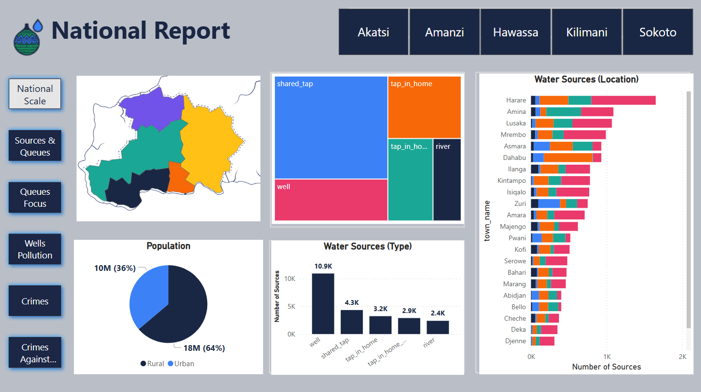
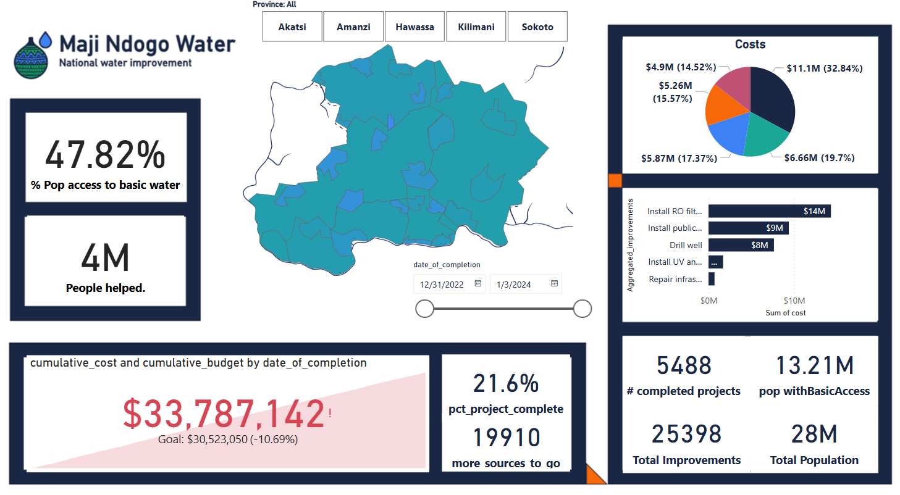
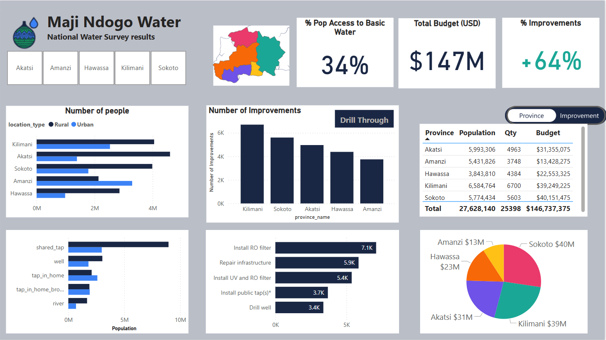
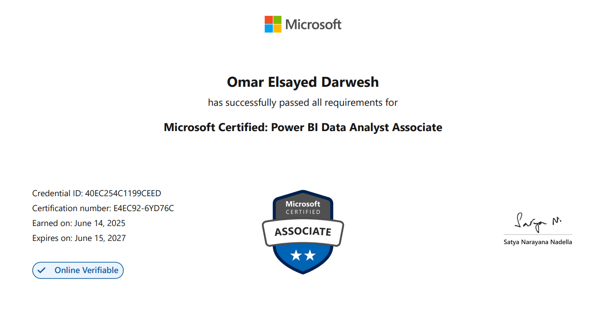
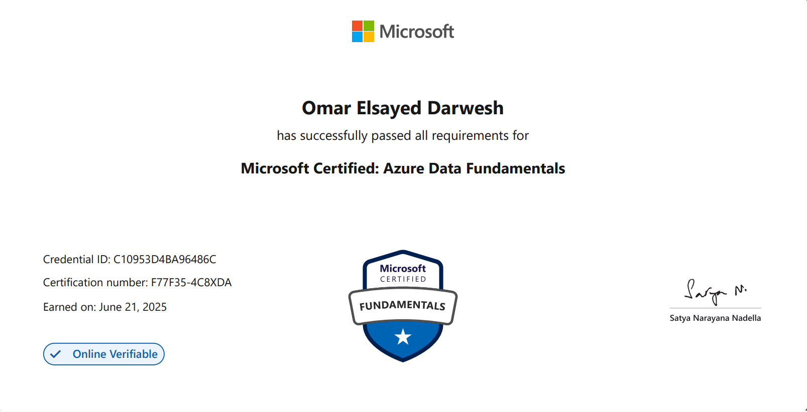
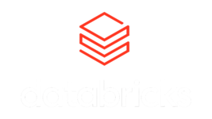

 
 
 
 
 
 
 

Hi there 👋,

Let me introduce myself. 

I'm Omar Darwesh.

I'm a Computer Science postgraduate with an analytical mindset and a deep enthusiasm for **Data Analysis**, **Business Intelligence (BI)** & **Analytics Engineering**.

 
 
 

# Technical Experience

 

## **Data Engineering Trainee** 
### &nbsp;&nbsp;&nbsp;&nbsp; at ALX Africa, Egypt
&nbsp;&nbsp;&nbsp;&nbsp; *Duration: July 2026 - Present*

&nbsp;&nbsp;&nbsp;&nbsp;&nbsp;&nbsp;&nbsp;&nbsp;&nbsp;&nbsp;&nbsp;&nbsp; 

- Gaining expertise in **Python**, **Docker**, **Apache Airflow**, **Apache Spark**, **Apache Kafka**, and other key data Engineering tools and big data technologies.

 
 

## **Data Science Trainee** 
### &nbsp;&nbsp;&nbsp;&nbsp; at ALX Africa, Egypt
&nbsp;&nbsp;&nbsp;&nbsp; *Duration: 1.5 years*

&nbsp;&nbsp;&nbsp;&nbsp;&nbsp;&nbsp;&nbsp;&nbsp;&nbsp;&nbsp;&nbsp;&nbsp; 

- Worked on multiple assignments with tight deadlines.
  
- Gained expertise in **SQL**, **Python**, **Power BI**, and other key data analysis tools.

 
 

## **Data Analysis Trainee** 
### &nbsp;&nbsp;&nbsp;&nbsp; at Information Technology Institute (ITI), Ministry of Communication and Information Technology (MCIT), Egypt
&nbsp;&nbsp;&nbsp;&nbsp; *Duration: 5 months*

&nbsp;&nbsp;&nbsp;&nbsp;&nbsp;&nbsp;&nbsp;&nbsp;&nbsp;&nbsp;&nbsp;&nbsp; 

- Acquired advanced skills in **data cleaning**, **data analysis**, **visualization**, and **reporting**.
  
- Worked with a variety of tools such as **SQL**, **Excel**, **Python**, **Power BI**, **Tableau**, and more.

 
 
 
 
 

---

 
 

I primarily worked on developing a variety of deliverables such as presentations, dashboards, and reports using tools like **SQL**, **Python**, **Power BI**, **Excel**, **Google Sheets**, **Google Slides**, **PowerPoint**, **Figma**, and others as needed.
   
 
 

A key focus throughout was making insights easily understandable for all kinds of audiences, especially **non-technical stakeholders**, so that data-driven decisions could be made with clarity and confidence.

 
 
 
 
 

In **Jupyter Notebook**, **Google Colab** & **VS Code**, I performed data exploration, cleaning, analysis, and visualization using Python and others, as well as documented each step of the workflow.

 

 
 
 

I used  **Excel**, **SQL**, **Python**, **Google Sheets** for Exploring and Cleaning data existing in files like CSVs and databases like Microsoft SQL Server & MySQL.

 

 
 
 

I used **Figma**, **draw.io**, **PowerPoint** and **Google Slides** for Sketching and Designing wireframes and dashboards/reports, visualizing report structures, and communicating insights.

 

 
 
 

I experienced different visualization tools like **Power BI, Tableau, Looker Studio, Flourish, and Python**.

 

 
 
 

A few examples of the type of visualizations I created are like these:

 

 

 

 
 
 

<!-- -->

<!-- -->

<!---->

 
 
 

I know what you're thinking right now. You wanna see a couple of interactive dashboard/report samples.

Kindly have a look at a few Reports/Dashboards for interactive insights I built with **Power BI**:

<ul>
  <li><a href="https://app.powerbi.com/view?r=eyJrIjoiZmRiODJiZjYtYTA3Mi00ODFjLThmMWYtY2QxZDY4NWI1YzJmIiwidCI6ImRmODY3OWNkLWE4MGUtNDVkOC05OWFjLWM4M2VkN2ZmOTVhMCJ9"
         target="_blank" rel="noopener noreferrer">
    Visualizing the Currents of Change — Part 1
  </a></li>

  <li><a href="https://app.powerbi.com/view?r=eyJrIjoiZDAzZGVjZDAtMDBhYy00ZWI2LTkyOWUtMmFkNGM3ODc3NzZkIiwidCI6ImRmODY3OWNkLWE4MGUtNDVkOC05OWFjLWM4M2VkN2ZmOTVhMCJ9"
         target="_blank" rel="noopener noreferrer">
    Visualizing the Currents of Change — Part 2
  </a></li>

  <li><a href="https://app.powerbi.com/view?r=eyJrIjoiNzdmYjFlNmYtMmIxYi00MTdkLWEwMTAtZDFhMWVkNDU1MWZiIiwidCI6ImRmODY3OWNkLWE4MGUtNDVkOC05OWFjLWM4M2VkN2ZmOTVhMCJ9"
         target="_blank" rel="noopener noreferrer">
    Visualizing the Currents of Change — Part 3
  </a></li>

  <li><a href="https://app.powerbi.com/view?r=eyJrIjoiNmQ5Zjc3NTctMmU3NC00ZjA5LWE1ZjktNDhlM2M1ZjIxNDQ2IiwidCI6ImRmODY3OWNkLWE4MGUtNDVkOC05OWFjLWM4M2VkN2ZmOTVhMCJ9"
         target="_blank" rel="noopener noreferrer">
    Visualizing the Currents of Change — Part 4
  </a></li>

  <li><a href="https://app.powerbi.com/view?r=eyJrIjoiZjFhMmI0OWEtMWU5Yi00YmE0LWE1ZjAtZWJmNGJiNjQzYTQwIiwidCI6ImRmODY3OWNkLWE4MGUtNDVkOC05OWFjLWM4M2VkN2ZmOTVhMCJ9"
         target="_blank" rel="noopener noreferrer">
    Visualizing the Currents of Change — Part 5
  </a></li>
</ul>

 

---

 
 
 
 
 

# Certifications

I worked very hard to get certified by Microsoft in **Power BI** and **Azure Cloud**, aiming to deepen my knowledge and gain exposure to higher levels of use cases and data challenges at a more advanced level.

 
 

## Microsoft Certified: Power BI Data Analyst:

<a href="https://learn.microsoft.com/en-us/users/iamomardarwesh/credentials/40ec254c1199ceed" target="_blank" rel="noopener noreferrer"><strong>View Credential</strong></a>

<!---->

 
 

## Microsoft Certified: Azure Data Fundamentals:

<a href="https://learn.microsoft.com/en-us/users/iamomardarwesh/credentials/c10953d4ba96486c" target="_blank" rel="noopener noreferrer"><strong>View Credential</strong></a>

<!---->

 

---

 
 
 
 
 

# Professional Certificates

I am a results-driven professional with a strong focus on acquiring practical, in-demand skills.

I actively pursue continuous learning to sharpen my skills, expand my knowledge, and stay updated. I am consistently investing in industry-recognized certifications to build strong, job-ready skills that enable me to contribute effectively and grow within data-driven teams.

 

### Udacity Certificates:

  - **Data Visualization Nanodegree**

 

### A few of edX Certificates:

  - **Professional Certificate in Agile Project Management** <u>by The University of Maryland, College Park</u>  (in progress...)

 

### 365 Data Science Certificates:

  - **Mastering Key Performance Indicators (KPIs)**

 

### A few of Coursera Certificates:

  - **Excel Skills for Business** <u>by Macquarie University</u>

  - **Excel Skills for Data Analytics and Visualization** <u>by Macquarie University</u>

  - **Python for Everybody** <u>by University of Michigan</u>

  - **Machine Learning** <u>by DeepLearning.AI, Stanford University</u>

  - **Modern Big Data Analysis with SQL** <u>by Cloudera</u>

  - **IBM Data Warehouse Engineer** <u>by IBM</u>

  - **IBM Data Engineer** <u>by IBM</u>

 

### A few of DataCamp Certificates:

  - **Data Analyst Associate**

  - **SQL Associate**

  - **SQL for Business Analysts**

  - **SQL for Database Administrators**

  - **Associate Data Analyst in SQL**

  - **Associate Data Engineer in SQL**

  - **Associate Python Developer**

  - **Python Programming**

 

---

 
 
 
 
 

# Education

I joined Cairo University to pursue an academic degree in Computer Science, driven by my ambition to deepen my technical expertise and grow as a professional in the field.

 

## Cairo University  
### &nbsp;&nbsp;&nbsp;&nbsp; Postgraduate Degree in Computer Science

&nbsp;&nbsp;&nbsp;&nbsp; - *Graduated with **Excellent** Standing*  
&nbsp;&nbsp;&nbsp;&nbsp; - **GPA:** 3.7 / 4.0  
&nbsp;&nbsp;&nbsp;&nbsp; - *Graduation Year: 2025*

 

---

 
 
 
 
 

# Projects

 
 

<!-- PROJECT 1 -->

  
## Problem-Solving and Transformative Data Analysis & Insights for Sustainable Solutions  
> *Turning data into action - using SQL, Power BI, and analytics to bring clean water, equity, and hope to millions.*  

### Tools:

`SQL`, `MySQL`, `Python`, `Jupyter Notebook`, `Power BI`, `Figma`, `PowerPoint`

  <h4>📋 At a Glance</h4>
  

    

      ⚠️ Problem
       
 In Maji Ndogo, only 33% (≈9M of 28M people) had access to safely managed drinking water based on UN standards of the global (SDG 6) targets, with over 25,000 contaminated, failing, or needed water sources and severe social impacts, including safety risks for women and children traveling long distances. 
 
    

    

      ⚡ Action
       
 Connected to a MySQL database and performed deep SQL exploration, cleaning, and transformation of water-source data in Jupyter Notebook; used Power BI to visualize insights and build data-story dashboards. 
 
        
 Designed mockups in Figma and PowerPoint to align storytelling with analytical flow and prioritized urgent intervention zones based on contamination, source type, and regional vulnerability. 
 
        
 Prioritized high-risk regions and recommended short-term repairs and long-term infrastructure solutions. 

    

    

      ✅ Result
       
 Guided targeted repairs, new wells, and equitable water distribution strategies, improving clean-water access for ~18 million people and strengthening community resilience and quality of life. 
 
    

  

  

    <ul class="project-bullets">
      <li>Aligned with <strong>UN Global Goal 6 - Clean Water and Sanitation</strong>, part of the broader <strong>UN Global Goals</strong> (Sustainable Development Goals), which aim to ensure sustainable water and sanitation for all. This includes universal access to safe drinking water, ending open defecation, improving water quality, and promoting long-term, resilient water resource management.</li>
      <li>Focused on <strong>SDG 6.1.1 - Access to Safely Managed Drinking Water</strong>, a key indicator under the <strong>United Nations (UN) Sustainable Development Goals (SDGs)</strong>, aiming to ensure clean and safe water for all in Maji Ndogo.</li>
      <li>More details on this goal can be found via the <strong>UN Global Goals platform</strong>: <a href="https://globalgoals.org/goals/6-clean-water-and-sanitation/" target="_blank" rel="noopener noreferrer">UN Global Goal 6 - Clean Water and Sanitation</a></li>
      <li>Connected to a <strong>MySQL database</strong> and conducted deep <strong>SQL-based exploration, cleaning, and transformation</strong> of water source data directly in <strong>Jupyter Notebook</strong>, with light Python support for additional processing.</li>
      <li>Used <strong>Power BI</strong> to visualize insights and craft <strong>data storytelling dashboards</strong> for long-term impact tracking and transparent decision-making.</li>
      <li>Designed dashboard mockups and story flow in <strong>Figma and PowerPoint</strong> to align visuals with the analytical narrative.</li>
      <li>Discovered that only <strong>33% (≈9M of 28M people)</strong> had access to safe drinking water and identified urgent action zones.</li>
      <li>Revealed over <strong>25,000 contaminated, failing, or needed water sources</strong> requiring immediate attention and categorized issues by source type (tap, well, shared tap, river).</li>
      <li>Prioritized interventions for <strong>most vulnerable regions</strong>, implementing <strong>quick temporary fixes</strong> and <strong>long-term sustainable solutions</strong>.</li>
      <li>Exposed broader social issues like <strong>crime risks</strong> for women and children traveling long distances for water, emphasizing the human dimension of data.</li>
      <li>Delivered actionable insights that guided new wells, repairs, and equitable water distribution - improving quality of life and community resilience.</li>
      <li>Achieved a <strong>transformative impact</strong>, with <strong>~18 million people</strong> gaining access to clean water and living conditions improving significantly.</li>
    </ul>
    

      <strong>View Full Project:</strong>
      <a href="https://github.com/IamOmarDarwesh/Sustainable-Data-Driven-Solutions-through-Data-Analysis-of-Water-Crisis" target="_blank" rel="noopener noreferrer">Sustainable Data-Driven Solutions through Data Analysis of Water Crisis</a>
    

  

  
  <button class="read-more-btn" aria-expanded="false">
    Read More
    ▼
  </button>

 
 
 
 

<!-- PROJECT 2 -->

## Call Center Performance Analytics Dashboard  

> *Turning call center data into smarter decisions and happier customers.*  

### Tools Used:

`Power BI`, `DAX`, `Excel`, `Figma`

  <h4>📋 At a Glance</h4>
  

    

      ⚠️ Problem
       
 High call abandonment during peak hours, unclear performance metrics, low-resolution performance areas, and inefficient agent scheduling were hurting service quality and driving up costs of the call center. 
 
    

    

      ⚡ Action
       
 Defined business objectives and KPIs, sketched an intuitive dashboard layout, and developed an interactive Power BI dashboard analyzing call patterns, agent behavior, handle times, and customer satisfaction. 
 
        
 Identified peak-hour bottlenecks, recommended schedule and operating-hour adjustments, highlighted low-performance areas, and proposed targeted agent training initiatives. 

    

    

      ✅ Result
       
 Delivered insights resulting in reduced abandonment rates, lowered operating costs, improved agent performance and service quality, and enabled faster, data-driven operational decisions. 
 
    

  

  

    <ul class="project-bullets">
      <li>Defined <strong>business objectives, KPIs, and performance metrics</strong> to guide strategic growth.</li>
      <li><strong>Sketched and designed</strong> intuitive dashboard layouts for clear and digestible data visualization.</li>
      <li>Developed an <strong>interactive Power BI dashboard</strong> to analyze and optimize call center performance.</li>
      <li>Discovered that <strong>40% of abandoned calls</strong> occurred during two peak hours → optimized agent scheduling.</li>
      <li>Recommended <strong>adjusting operating hours (earlier closing time) (6 PM → 5 PM)</strong> to reduce cost and reallocate staff to peak demand.</li>  
      <li>Identified low-resolution areas (Technical Support, Payment) and proposed <strong>targeted training plans</strong> for agents.</li>  
      <li>Delivered <strong>real-time analytics</strong> on agent behavior, handle time, and customer satisfaction trends.</li>
      <li>Empowered stakeholders with <strong>actionable insights and data-backed recommendations</strong> for smarter, cost-efficient decision-making that improved service quality and operational efficiency.</li>
    </ul>
    

      <strong>View Full Project:</strong>
      <a href="https://github.com/IamOmarDarwesh/Call-Center-Performance-Analytics-Dashboard" target="_blank" rel="noopener noreferrer">Call Center Performance Analytics Dashboard</a>
    

  

  
  <button class="read-more-btn" aria-expanded="false">
    Read More
    ▼
  </button>

 
 
 
 

<!-- PROJECT 3 -->

## Modern SQL Data Warehouse Building & Analytics  
> *Building a scalable data foundation for smarter analytics and reliable insights through modern data architecture and SQL engineering.*

### Tools Used:

`SQL Server`, `SSMS`, `Draw.io`, `Notion`, `GitHub`

  <h4>📋 At a Glance</h4>
  

    

      ⚠️ Problem
       
 Fragmented ERP/CRM data silos and lack of a scalable architecture prevented consistent business reporting and limited analytical capabilities. 
 
    

    

      ⚡ Action
       
 Explored business requirements, designed a Medallion (Bronze–Silver–Gold) data warehouse in Draw.io, built the warehouse in SQL Server, and implemented ETL pipelines for ingestion, validation, integration, and transformation. 
 
        
 Performed data profiling, cleansing, and standardization in the Silver layer, and modeled analytics-ready star-schema tables in the Gold layer.
 
    

    

      ✅ Result
       
 Delivered scalable, clean, unified, analytics-ready data resulting in deeper SQL-driven insights into sales, customer behavior, and product performance, enabling faster insights and data-driven decisions. 
 
        
 Improved transparency and collaboration through structured documentation, architecture design, and GitHub version control. 
 
    

  

  

    <ul class="project-bullets">
      <li><strong>Explored and analyzed business requirements</strong> to define objectives, data needs, project scope, and deliverables.</li>
      <li><strong>Planned and structured the project in Notion</strong>, organizing all stages - from architecture design to validation and documentation - with clearly defined phases, timelines, and milestones.</li>
      <li><strong>Designed the data warehouse architecture</strong> in Draw.io, following the <strong>Medallion Architecture</strong> (Bronze–Silver–Gold).</li>
      <li><strong>Built a modern SQL data warehouse</strong> integrating data from <strong>ERP and CRM systems</strong> (CSV sources).</li>
      <li><strong>Implemented ETL pipelines</strong> for data ingestion, validation, integration, and transformation across layered architecture.</li>
      <li><strong>Performed data profiling, quality checks, cleansing, and standardization</strong> in the Silver layer to ensure accuracy, consistency, and reliability.</li>
      <li><strong>Modeled the Gold layer</strong> using a <strong>star schema</strong> with fact and dimension tables optimized for analytics (business-ready data).</li>
      <li><strong>Developed SQL-based analytics</strong> to uncover insights into sales trends, customer behavior, and product performance.</li>
      <li><strong>Used GitHub for version control and project tracking</strong> to ensure transparency, traceability, and collaboration.</li>
    </ul>
    

      <strong>View Full Project:</strong>
      <a href="https://github.com/IamOmarDarwesh/Modern-SQL-Data-Warehouse-Building-Analytics" target="_blank" rel="noopener noreferrer">Modern SQL Data Warehouse Building &amp; Analytics</a>
    

  

  
  <button class="read-more-btn" aria-expanded="false">
    Read More
    ▼
  </button>

 
 
 
 

<!-- PROJECT 4 -->

## Superstore Sales Executive Performance Analytics & BI Dashboard
> *Turning four years of sales data into an executive decision-support dashboard that uncovers the drivers behind growth, profitability, and business performance, turning revenue, margin, and customer signals into strategic decisions.*

### Tools:
`Tableau`, `Sketching & Wireframing`, `Dashboard Design`, `Data Storytelling`, `Data Visualization`

  <h4>📋 At a Glance</h4>
  

    

      ⚠️ Problem
        
 Executive leadership relied on high-level KPIs like revenue and units sold as primary success metrics, which masked a critical issue: despite top-line growth, profitability was deteriorating. 
 
        
 These surface-level indicators concealed eroding margins, underperforming product categories, hidden margin compression across categories, and misaligned customer segment performance - leaving the executive team without a clear view of where the business was actually making or losing money and no clear visibility into where to focus for profitable growth. 
 
    

    

      ⚡ Action
       
 Designed and developed an interactive Tableau executive dashboard analyzing and consolidating four years (2015–2018) of sales data into a single analytical interface. 

        
 Engineered a dynamic parameter-driven metric selector enabling instant switching between Sales, Profit, Profit Ratio, and Quantity across all visualizations - replacing multiple static reports with one flexible tool eliminating the need for multiple reports. 

        
 Structured the dashboard using layered information hierarchy, conditional formatting, and drill-down capabilities to surface opportunities and risks instantly and to support executive decision-making. Applied accessibility-first design principles to ensure clarity for all users. 
 
    

    

      ✅ Result
       
 Transformed executive decision-making by shifting the conversation from "how much did we sell?" to "where are we actually profitable?". 
 
        
 Enabled leadership to reallocate marketing spend toward the high-growth, high-margin Home Office segment, investigate pricing and discounting practices in the Corporate and Furniture segments, and prioritize low-effort, high-return product opportunities - driving a more capital-efficient growth strategy and protecting margins while scaling revenue, equipping leadership to move from reactive reporting to forward-looking strategic decisions. 
 
    

  

  

    <ul class="project-bullets">
      <li>Designed and developed an <strong>interactive executive Tableau dashboard</strong> analyzing <strong>four years of sales data (2015-2018)</strong>, enabling stakeholders to monitor revenue, profitability, customer behavior, product performance, and business trends from a single analytical interface.</li>
      <li>Applied business intelligence techniques to move beyond descriptive reporting, uncovering critical insights such as <strong>margin compression despite revenue growth</strong>, underperforming product categories, high-value customer segments, and hidden profit drivers.</li>
      <li>Engineered a <strong>dynamic parameter-driven metric selector</strong> that instantly switches every visualization between <strong>Sales, Profit, Profit Ratio, and Quantity</strong>, allowing multiple analytical perspectives without duplicating dashboards.</li>
      <li>Structured the dashboard around executive decision-making principles using layered information hierarchy, interactive filtering, conditional formatting, and drill-down analysis to help users quickly identify opportunities, risks, and performance drivers.</li>
      <li>Applied accessibility-first design principles, including a <strong>structured font hierarchy</strong> and <strong>color-vision-deficiency-safe palettes</strong>, ensuring the dashboard functions as a strategic tool, not just a visual one.</li>
      <li>Uncovered a critical disconnect hiding behind healthy top-line growth: <strong>Corporate revenue grew 17% in 2018 while profit fell 13.65%</strong>, and <strong>Furniture generated $742K in sales but only a 3.88% margin</strong> - less than a quarter of Technology's 15.64%.</li>
      <li>Identified the <strong>Home Office segment as the highest-leverage growth opportunity</strong>, with <strong>51% revenue growth, 40% profit growth, and the highest profit ratio of all three segments since day one</strong> despite remaining the smallest.</li>
      <li>Pinpointed hidden margin opportunities at the product level: <strong>Paper, Labels, and Envelopes consistently delivered 42%+ profit margins</strong>, and <strong>Copiers produced 29-38% margins</strong> while rarely appearing among top-volume products, both flagged as high-leverage, low-effort wins.</li>
      <li>Translated analytical findings into <strong>actionable business recommendations</strong>, including pricing optimization, customer segment prioritization, product portfolio improvements, and profitability monitoring to support data-driven strategic decisions, equipping stakeholders to move from historical reporting to forward-looking strategy.</li>
    </ul>
    

      <strong>View Full Project:</strong>
      <a href="https://github.com/IamOmarDarwesh/Superstore-Executive-Analytics-BI-Dashboard-Planned-Designed-Analyzed-Polished-for-Executive-Insight" target="_blank" rel="noopener noreferrer">Superstore Executive Analytics BI Dashboard Planned Designed Analyzed Polished for Executive Insight</a>
    

  

  
  <button class="read-more-btn" aria-expanded="false">
    Read More
    ▼
  </button>

 
 
 
 

<!-- PROJECT 5 -->

## AI Chatbot Performance & Customer Experience Analytics Suite

> *Thousands of real AI chatbot interactions across 3.5 years, turned into a five-part executive intelligence suite, uncovering where AI succeeds, where trust breaks down, and what customers truly feel.*

Tools:

`Tableau`, `Sketching & Wireframing`, `Dashboard Design`, `Data Storytelling`, `Data Visualization`, `Business Intelligence`, `Customer Analytics`, `Sentiment Analysis`

  <h4>📋 At a Glance</h4>
  

    

      ⚠️ Problem
       
 The organization deployed an AI chatbot as the frontline of customer support but lacked visibility into whether it was actually delivering value.  
 
        
 Leadership tracked only high-level metrics like resolution rates and response times, which masked critical issues: declining customer satisfaction, uneven performance across languages, newer versions underperforming older ones, and no understanding of how customers actually felt during interactions or where the chatbot was quietly damaging brand perception.  
 
 
    

    

      ⚡ Action
       
 Led a comprehensive five-part analytics suite analyzing thousands of real chatbot interactions across 3.5 years (2023–2026).  
  
        
 Designed and built five interconnected Tableau dashboards covering executive performance, escalation patterns, sentiment analysis, temporal trends, and granular language-query type emotional hotspots.  
  
        
 Engineered the analysis to move from broad KPIs to targeted diagnostics, enabling stakeholders to identify exactly where the chatbot succeeds, where it fails, and which specific interaction segments drive positive or negative customer outcomes. 
  
        
 Engineered the suite to move stakeholders from "what happened?" to "where should we act?" in a single analytical session.  
  
    

    

      ✅ Result
       
 Delivered a complete decision framework that shifted the organization's evaluation of AI from operational efficiency to customer experience quality. 
  
        
 Uncovered that an 85% resolution rate masked a 3.15/5 satisfaction score—proving resolution alone doesn't equal customer happiness.
        Identified that v1.1 outperformed all newer releases in sentiment, challenging the assumption that "newer = better" and prompting a re-evaluation of version update strategies. 
 
        
 Pinpointed that German and French interactions had the highest escalation and unresolved rates, enabling targeted multilingual optimization.
        Revealed that responses of 25–50 words generated the highest sentiment, while under 25 words was the only negative-sentiment category—a simple, implementable design change with measurable impact. 
  
        
 Surfaced a sharp Q4 2025 sentiment decline as an early warning signal, enabling proactive intervention before churn or broader customer satisfaction eroded. 
  
        
 Equipped leadership with a repeatable framework for monitoring AI performance, trust, and customer experience across languages, versions, and query types. 
  
    

  

  

    <ul class="project-bullets">
      <li>Designed and developed a <strong>five-part interactive Tableau analytics suite</strong> that guides stakeholders from executive KPIs to escalation mapping to multi-dimensional sentiment analysis and detailed analyses of escalation & resolution patterns, sentiment trends, multilingual performance, and customer experience - each dashboard answering a distinct strategic question and feeding the next.</li>
      <li>Analyzed <strong>thousands of chatbot interactions (2023-2026)</strong> across chatbot versions, languages, query types, response lengths, and operational outcomes to identify the key drivers of customer satisfaction and operational efficiency and evaluate chatbot effectiveness.</li>
      <li>Built executive dashboards with interactive filters, KPI cards, trend analyses, heatmaps, and drill-down capabilities, enabling users to explore chatbot performance from multiple business perspectives.</li>
      <li>Combined operational KPIs with sentiment analysis to reveal hidden patterns such as multilingual performance gaps, high-risk escalation hotspots, the optimal response-length range, sentiment deterioration despite operational success, emotional trends, and high-impact optimization opportunities that aggregate metrics alone would not expose.</li>
      <li>Applied business storytelling, executive dashboard design principles, interactive filtering, and heatmaps to transform raw complex conversational data into strategic actionable recommendations for AI performance optimization, customer experience improvement, customer satisfaction, support efficiency, and data-driven decision-making.</li>
      <li>Designed an <strong>executive overview dashboard</strong> revealing an <strong>85% resolution rate</strong> alongside a <strong>3.15/5 average satisfaction score</strong>, exposing the critical insight that <em>resolution does not equal satisfaction</em>, and that <strong>earlier chatbot version v1.0 outperformed every newer release</strong> on customer sentiment.</li>
      <li>Conducted a <strong>deep escalation and resolution analysis</strong>, pinpointing that <strong>General Queries drive the highest escalation volume</strong> despite being the most common interaction type, and isolating the exact failure combination (<strong>Others + French + v1.0</strong>) responsible for the dataset's highest unresolved-interaction rate, while also surfacing a <strong>zero-escalation, zero-unresolved success case</strong> (German "Other" queries on v2.0) as a model to replicate.</li>
      <li>Built a <strong>three-stage sentiment intelligence layer</strong> (overview → trends → granular heatmaps) uncovering that customer experience is <strong>highly polarized, ~25% very positive, ~25% very negative, only ~10% neutral</strong>, and that <strong>responses of 25–50 words</strong> generate the strongest sentiment, while sub-25-word replies are the only category with negative sentiment.</li>
      <li>Tracked sentiment as a <strong>leading indicator over time</strong>, identifying a sentiment peak in <strong>Q1 2024</strong>, a sharp drop in <strong>Q2 2024</strong>, and the dataset's <strong>lowest point in Q4 2025</strong>, flagging an early-warning signal that resolution metrics alone would have missed entirely.</li>
      <li>Surfaced <strong>emotional hotspots at the language × query-type intersection</strong>, finding <strong>German Feedback interactions scored highest in sentiment</strong> overall, while <strong>German Product Inquiries became the most negative segment</strong> under escalated/unresolved conditions; proof that aggregate metrics hide segment-level risk.</li>
      <li>Delivered a <strong>prioritized, cross-functional action plan</strong> (technical support optimization, multilingual model investment, response-length standards, version benchmarking) translating five layers of analysis into concrete, ROI-ranked recommendations for AI and CX leadership.</li>
    </ul>
    

      <strong>View Full Project:</strong>
      <a href="https://github.com/IamOmarDarwesh/An-Executive-Analytics-Suite-for-AI-Chatbot-Performance-Trust-and-Customer-Experience" target="_blank" rel="noopener noreferrer">An Executive Analytics Suite for AI Chatbot Performance Trust and Customer Experience</a>
    

  

  
  <button class="read-more-btn" aria-expanded="false">
    Read More
    ▼
  </button>

 
 
 
 

<!-- PROJECT 6 -->

## When Growth Met Emissions: A Data-Driven Story of Economic Growth & Carbon Decoupling

> *Transforming 25 years of World Bank global economic and environmental data across 217 countries into an interactive story that challenges one of the most widely accepted assumptions in economic development that getting richer doesn't have to mean polluting more, and a growing group of nations is proving it.*

### Tools:

`Flourish`, `Tableau`, `Data Storytelling`, `Audio Narration`, `Data Visualization`, `Statistical Analysis`

  <h4>📋 At a Glance</h4>
  

    

      ⚠️ Problem
       
 For decades, the assumption that "growth requires rising emissions" has quietly shaped boardroom strategy, national policy, and global development plans. 
  
        
 Leaders treated the trade-off as an unchangeable economic law, missing the strategic opportunity to decouple growth from environmental cost—and lacking the data to prove the assumption wrong. 

        
 This blind spot kept capital locked in high-carbon investments and delayed the transition to cleaner growth models and no clear way to identify which countries had actually broken the pattern, or how. 
 
    

    

      ⚡ Action
       
 Designed and executed a full data storytelling pipeline using 25 years of World Bank indicators across 217 countries. 
  
        
 Built an interactive, narrated Hans Rosling-style animated visualization in Flourish tracking GDP per capita against CO₂ emissions per capita year by year (1990–2014), with population, region, and income group layered in. Structured the experience as a guided three-act narrative (1990s, 2000s, 2006–2014), supported by filters, annotations, and outlier deep-dives—making a dense, multi-decade global dataset intuitive to a non-technical audience in minutes. 
  
        
 Distilled the analysis into targeted, actionable recommendations for business, policy, and investment audiences. 
 
    

    

      ✅ Result
       
 Equipped leaders with data-driven proof that economic growth and emissions reduction can move in opposite directions at scale, shifting the conversation from "is this possible?" to "how do we get on that path faster?". 
  
        
 Uncovered and quantified a decoupling group spanning diverse economic profiles—small open economies, advanced finance hubs, and resource-based economies in transition—removing the most common excuse for inaction. 
 
        
 Demonstrated that double-digit metric-ton emissions reductions are achievable alongside continued GDP growth (Aruba: −18.5 metric tons, 2006–2014; Luxembourg: sustained decline across three decades). 

        
 Reframed decarbonization investment as a growth multiplier, not a cost center, enabling organizations and policymakers to benchmark against real-world proof points rather than aspirational targets and prioritize high-leverage interventions where the traditional growth-emissions link is strongest. 
 
    

  

  

    <ul class="project-bullets">
      <li>Tackled a long-standing economic assumption, "growth requires rising emissions", by analyzing <strong>25 years (1990–2014) of World Bank indicators across 217 countries and territories</strong> to investigate whether economic growth must come at the expense of rising carbon emissions, uncovering measurable evidence of long-term economic–environmental decoupling.</li>
      <li>Designed and built a <strong>Hans Rosling-inspired animated bubble chart</strong> in Flourish, combining GDP per capita, CO₂ emissions, population, region, and income group into an intuitive, time-based visualization that reveals decades of global trends in minutes.</li>
      <li>Engineered a <strong>multi-step interactive data story</strong>, spanning three decades (1990s, 2000s, 2006–2014), with narration, annotations, filters, and guided analysis, making complex longitudinal data accessible to technical and non-technical audiences alike.</li>
      <li>Identified and communicated actionable insights showing that multiple countries achieved sustained GDP growth while reducing emissions, reframing decarbonization as a strategic growth opportunity rather than an economic trade-off.</li>
      <li>It is a <strong>distinct "decoupling" group</strong>, including Luxembourg, Singapore, Ireland, Switzerland, the U.S., Aruba, and more, that grew significantly wealthier while <em>cutting</em> emissions, not just slowing their rise.</li>
      <li>Quantified standout outliers: <strong>Aruba cut emissions by over 18.5 metric tons per capita (2006–2014)</strong> while still growing economically, and <strong>Luxembourg sustained falling emissions across three straight decades</strong> alongside tens of thousands of dollars in GDP per capita growth.</li>
      <li>Proved decoupling isn't tied to one economic profile, it spans small open economies, advanced finance hubs, and resource-based economies in transition, removing the common excuse that it "can't apply" to a given sector or region.</li>
      <li>Delivered findings through <strong>both an interactive data visualization and a long-form written analysis</strong>, translating a 25-year, multi-indicator global dataset into a story a non-technical audience could grasp in minutes.</li>
      <li>Distilled insights into targeted <strong>recommendations for business leaders, policymakers, investors, and ESG teams</strong>, reframing decarbonization as a growth strategy rather than a compliance cost.</li>
    </ul>
    

      <strong>View Full Project:</strong>
      <a href="https://github.com/IamOmarDarwesh/Decoupling-Economic-Growth-from-Carbon-Emissions-A-25-Year-World-Bank-Data-Analysis-Redefining-Rules" target="_blank" rel="noopener noreferrer">Decoupling Economic Growth from Carbon Emissions: A 25-Year World Bank Data Analysis Redefining Rules</a>
    

  

  
  <button class="read-more-btn" aria-expanded="false">
    Read More
    ▼
  </button>

 
 
 
 

<!-- PROJECT 7 -->

## Spectacular Studios - Movie Profitability Analysis & Executive Strategy

> **Turning thousands of IMDb film records into a data-driven production strategy that helps executives make smarter, lower-risk investment decisions, uncovering exactly which combination of budget, genre, runtime, language, and timing maximizes profit.**

### Tools:
`Tableau`, `PowerPoint`, `Python`, `Pandas`, `NumPy`, `Matplotlib`, `Jupyter Notebook`,  `Data Integration & Cleaning`, `Feature Engineering`, `Business Intelligence`

  <h4>📋 At a Glance</h4>
  

    

      ⚠️ Problem
       
 Spectacular Studios lacked a data-driven framework for multi-million-dollar greenlight decisions. Executives relied on instinct rather than evidence to choose the right combination of budget, genre, runtime, language, and release timing—resulting in inconsistent returns and no clear strategy for managing production risk.  
 
        
 This fragmented approach led to misaligned investments like high budgets on genres that couldn't support them, long films released off-peak, and missed opportunities in regional-language markets resulting in eroding returns and increasing portfolio risk.  
 
    

    

      ⚡ Action
       
 Built an end-to-end data analytics pipeline in Python that integrated, cleaned, and engineered business-relevant features from five raw IMDb datasets covering thousands of commercially released films. 
 
        
 Engineered business-focused metrics including profit, ROI, budget tiers, release seasons, runtime categories, and more.  
 
        
 Conducted multi-dimensional profitability analysis to uncover how production variables interact across genre, budget, runtime, language, and season—not as isolated factors, but as an interconnected system of production decisions. 
 
        
 Translated statistical findings into a strategic executive presentation with prioritized recommendations and a full limitations audit to ensure responsible application. 
  
    

    

      ✅ Result
       
 Enabled Spectacular Studios to shift from gut-driven greenlighting to a dual-engine portfolio strategy: high-budget peak-season blockbusters for maximum upside, paired with a steady mid-budget pipeline for consistent, lower-risk returns.  
 
        
 Established clear rules for budget-genre alignment, runtime-season matching, and language targeting by budget tier—giving leadership a repeatable, data-backed framework for allocating production capital more efficiently and reducing avoidable losses. 
 
        
 The analysis also surfaced critical risk awareness: the industry is driven by outliers, not averages—shifting the studio's decision-making from chasing mean performance to managing variance, protecting downside while pursuing upside. 
  
    

  

  

    <ul class="project-bullets">
      <li>Built an end-to-end <strong>data analytics pipeline</strong> that transformed five raw IMDb datasets into a clean, analysis-ready dataset by performing data integration, cleaning, validation, deduplication, and feature engineering on thousands of commercially released films.</li>
      <li>Engineered business-focused features including <strong>profit, ROI, budget tiers, release seasons, runtime categories, and profitability classifications</strong>, enabling deeper analysis of the factors influencing movie success.</li>
      <li>Conducted multi-dimensional profitability analysis across <strong>genre, budget, runtime, language, and release timing</strong>, identifying how these variables interact to maximize financial returns rather than evaluating them in isolation.</li>
      <li>Delivered executive-level recommendations by uncovering optimal production strategies, including budget allocation, genre selection, release windows, and language targeting, helping transform analytical findings into actionable business decisions.</li>
      <li>Uncovered that <strong>release timing alone drives ~2.5× more profit</strong> for Holiday and Summer releases versus Fall/Winter, and that <strong>runtime and season interact</strong>: long films (150+ min) post the highest upside in peak windows but drop sharply off-peak.</li>
      <li>Identified that <strong>budget-genre alignment is critical</strong>: Action, Sci-Fi, and Adventure require high budgets to succeed, while Horror and Romance perform best lean, with <strong>Animation uniquely strong across every budget tier</strong>.</li>
      <li>Surfaced a <strong>language strategy by budget tier</strong>: English dominates films over $100M, while mid- and low-budget films profit consistently across Chinese, Japanese, Telugu, and French markets.</li>
      <li>Conducted a <strong>full statistical distribution audit</strong>, revealing profit's mean ($59.4M) is <strong>nearly 6× its median ($11.2M)</strong>, proving that a handful of blockbusters skew industry averages and that the median, not the mean, should guide executive decision-making.</li>
      <li>Performed a comprehensive <strong>data quality, bias, and limitations assessment</strong>, documenting selection bias, survivorship bias, and missing-data challenges to ensure findings were interpreted responsibly and with appropriate business context.</li>
      <li>The <strong>rigorous limitations and bias audit</strong> quantifies that the dataset over-represents U.S. films by <strong>+35.6 points versus real-world output</strong> and that <strong>88% of the raw dataset was excluded</strong> during cleaning, making the analysis's scope and boundaries explicit rather than hidden.</li>
      <li>Presented the analysis through a polished executive presentation and supporting documentation, demonstrating the ability to combine <strong>data engineering, statistical analysis, business intelligence, and data storytelling</strong> to support strategic decision-making.</li>
    </ul>
    

      <strong>View Full Project:</strong>
      <a href="https://github.com/IamOmarDarwesh/Maximizing-Movie-Profitability-through-Transforming-Raw-Data-into-a-Data-Driven-Production-Strategy" target="_blank" rel="noopener noreferrer">Maximizing Movie Profitability through Transforming Raw Data into a Data-Driven Production Strategy</a>
    

  

  
  <button class="read-more-btn" aria-expanded="false">
    Read More
    ▼
  </button>

<!-- PROJECTS DIVIDER & COMING SOON ANIMATION -->

  

    
    ✦
    
  

  
  

    
    

      More exciting projects are on the way! 
      🚀
    

  

---

 
 
 
 
 

# Current Professional Development Focus

You might be wondering what I’ve been up to lately.

I’ve been focused on learning/mastering tools like **Docker**, **dbt**, **BigQuery**, **Databricks**, **Postgresql**, **Airflow**, **Kafka**, and **Spark** through hands-on experience.

Working to get comfortable with the full data pipeline, with a particular focus on mastering **data transformation**, alongside **data ingestion**, **warehousing**, **orchestration**, and **analytics**.

 

 

My goal here is to build **scalable, reliable, and maintainable data solutions** that drive real business impact and support better decision-making and long-term growth, from automated pipelines to insightful dashboards.

 

---

 
 
 

## Contact

  
Thanks for visiting my Profile!

  
If you like to connect, collaborate, or just say hello,

  
feel free to reach out anytime.

  
   
  
  &nbsp;
  &nbsp;
  &nbsp;
  
   
   
    
  &nbsp;
  &nbsp;
  &nbsp;

   
   

  <!-- 
  
  -->

    
  <!--
  
  
  
  -->

  
Looking forward to hearing from you!

 
 
 
 
 
 
 
